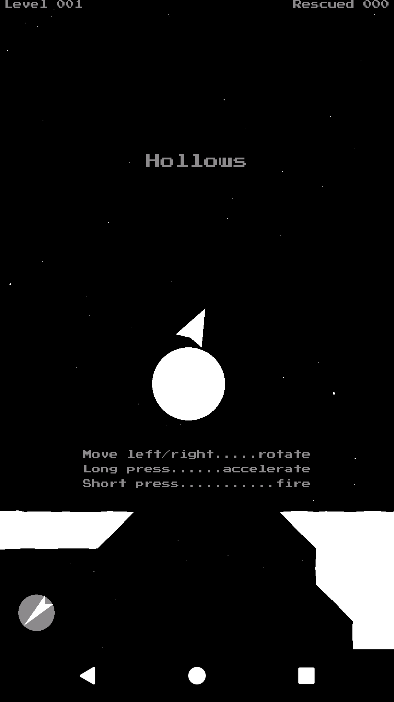

Hollows
=======

`Hollows` is an arcade game in the style of the 80s that&rsquo;s optimized for public transport:

* startup time is short
* no data connection required
* battery use is moderate
* levels are brief

In terms of UI, `Hollows`

* doesn't use buttons
* supports multitouch
* considers left-handed users

It recreates the keyboard controls of the 1986 Firebird classic Thrust using touch interactions.

The original offers five keyboard commands:

* `A`: rotate anti-clockwise
* `S`: rotate clockwise
* `Shift`: thrust
* `Return`: fire
* `Space`: shield

`Hollows` replaces these interactions with the following:

* swipe left: rotate anti-clockwise
* swipe right: rotate clockwise
* long press: thrust
* short press: fire

The 'shield' interaction of the original is missing. It has been replaced with a proximity trigger (for 'pick up'), but the 'protect' aspect has been dropped.

While it is possible to play `Hollows` without multitouch, it is much easier to use one finger for rotation and another to apply thrust. For increased thrust, place two or more fingers on the screen.

Sadly there is no Rob Hubbard title music.

Make and share your own levels
------------------------------
`Hollows` levels are ASCII art in a simple 50&times;50 grid. If you've created a new level, please consider sharing it by submitting a pull request. Take a look at the [existing levels](app/src/main/res/values/levels.xml).

Acknowledgements
----------------
ImpulseEngine 2D library [github.com/RandyGaul/ImpulseEngine](https://github.com/RandyGaul/ImpulseEngine/)) by @randypgaul.

Java port [github.com/ClickerMonkey/ImpulseEngine](https://github.com/ClickerMonkey/ImpulseEngine/) by Philip Diffenderfer.

PressStart2P font [fontlibrary.org/en/font/press-start-2p](https://fontlibrary.org/en/font/press-start-2p/) by Cody &ldquo;CodeMan38&rdquo; Boisclair.

Loops created in Smasher: [smasher.sourceforge.net](http://smasher.sourceforge.net).

Original sample "Synth loop" by LS: [www.freesound.org](samplesViewSingle.php?id=66381).
